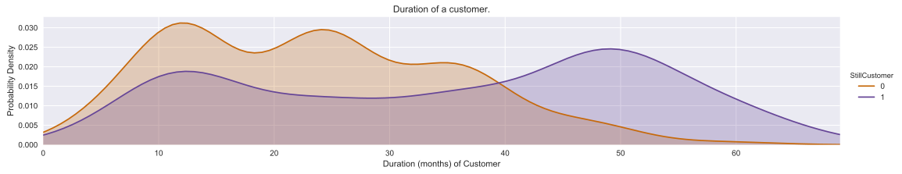
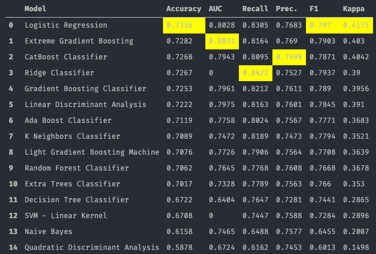
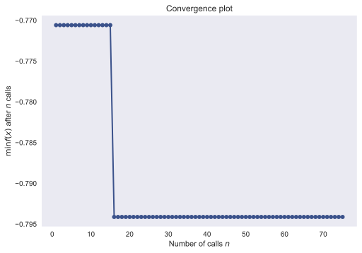
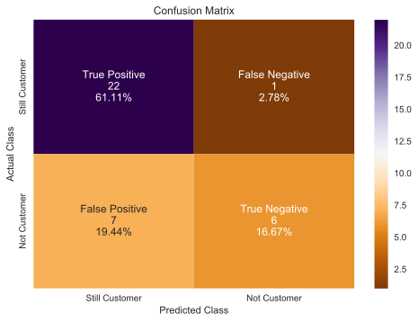

#  Description and Overview
## Evaluating Output & Performance of a Neural Network for Small-Sized Insurance Company

This project is a Proof of Concept (POC) project evaluating the output & performance of a Neural Network (NN) for a small-sized insurance company. We want to prove that applying Data Science principals and deep learning models can provide value to all size of businesses and with limited dastaset. 

We leverage a real-case data from Texas Giant Insurance (TGI). TGI focuses on providing commercial and personal insurance programs to its clients. TGI is an independent insurance company with an in-depth knowledge of multiple insurance products and carriers. They proactively provide service to their policyholders and present them to their clients.

  

  

We evaluated three models and showed that the deep learning model is the most accurate given the limited features and small dataset. We will look at accuracy though, it may be argued that F1 Score may be more relevant:
<ol>
<li>Supervised Learning (Logistic Regression) Model: 73.9%</li>
<li>Baseline Single-Layered NN: 69.4%</li>
<li>Bayesian Optimized Deep Learning NN: 77.8%</li>
</ol>

  

  

We are pleased to report the following findings from phone calls with customers:
<ul>
<li>Two customers who are no longer TGI customers said they would be interested in coming back but are price sensitive. </li>
<li>Two customers who are no longer TGI customers are interested in return; though, TGI may prefer not for them to come back.</li>
<li>One customer who is still a customer asked for a quote to another line of insurance products (automobile). This was a pleasant surprise and may provide future up-selling opportunities. </li>
</ul>

<i>Note: The Customer IDs have been modified to preserve customer privacy.</i>
